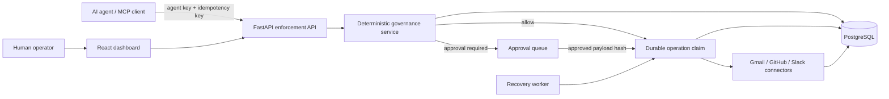

# AgentGuard AI Pro

**AI agent'ları aksiyon alabilir. AgentGuard neye izin verileceğine, neyin insan onayı gerektirdiğine ve eylemlerin nasıl denetleneceğine karar verir.**

AgentGuard AI Pro; AI agent eylemlerini tek, deterministik bir enforcement noktasından yöneten self-host edilebilir bir güvenlik ve yönetişim platformudur. FastAPI ve PostgreSQL platformu, React yönetim paneli, Python guardrail engine, Gmail/GitHub/Slack connector'ları, Python ve TypeScript SDK'ları ve MCP server aynı monorepo içinde yer alır.

> **Pilot maturity:** Kritik güvenlik akışları test edilmiştir; bu sürüm internete açık, yüksek erişilebilirlikli üretim profili değildir. Kalan operasyonel ve kurumsal gereksinimler açıkça belgelenir.

## Neyi kontrol eder?

- Tenant, kullanıcı, agent, connector grant ve resource scope doğrulaması
- `ALLOW`, `DENY` ve insan onayı kararları için açıklanabilir policy sonucu
- GitHub repository ve Slack channel düzeyinde least-privilege kapsam
- Action başına strict parametre şeması; bilinmeyen action ve alanlarda fail-closed davranış
- Onaylanan payload ile yürütülen payload arasında hash bütünlüğü
- Kalıcı operation claim, idempotency anahtarı ve belirsiz sonuçlarda güvenli durma
- HttpOnly refresh cookie, access token rotation ve oturum iptali
- Redacted audit metadata ile şifreli hassas payload ve provider sonucu
- Dashboard üzerinden approval, operation, agent, permission ve policy yönetimi

## Beş dakikada yerel kurulum

Gereksinimler: güncel Docker Desktop (Linux containers), PowerShell 7 ve boş `5000` portu.

```powershell
git clone https://github.com/furkanulusoy/agentguardai-pro.git
cd agentguardai-pro
pwsh -File scripts/start-local.ps1
```

Ardından **http://localhost:5000** adresini açıp ilk tenant hesabını oluşturun. Varsayılan kullanıcı veya parola yoktur. Script `.env` okumaz ya da yazmaz; yerel altyapı anahtarları ve PostgreSQL verisi git tarafından dışlanan `.local/` dizininde kalır.

Alternatif olarak:

```powershell
python scripts/prepare-local.py
docker compose up -d --build
```

Ayrıntılı kurulum ve ilk agent akışı için [yerel ürün rehberine](docs/LOCAL_PRODUCT.md) bakın.

## Güvenlik sınırı

AgentGuard yalnız kendi API'sinden geçen eylemleri kontrol eder. Provider credential'larını doğrudan agent'a vermeyin; aksi halde agent platformu atlayabilir. Gmail kapsamı mesaj kimliği ile From/Subject/Date metadata'sıdır. GitHub iki, Gmail iki, Slack beş doğrulanmış action sunar. Connector kapsamı hakkında ayrıntılar [güvenlik incelemesinde](docs/SECURITY_REVIEW.md) yer alır.

Durable operation claim ağ ve veritabanı hatalarında tekrar yürütme riskini azaltır; provider desteği olmadan evrensel bir exactly-once garantisi oluşturmaz. `UNKNOWN` sonuçlar otomatik yeniden çalıştırılmaz ve provider kayıtlarından doğrulanmalıdır.

## Mimari



`apps/api/services/governance.py` platform kararlarının tek kaynağıdır. SDK'lar ve MCP server policy kopyalamaz; bu API'yi çağırır.

| Dizin | Sorumluluk |
|---|---|
| `apps/api` | HTTP API, auth, tenant yönetimi ve enforcement |
| `apps/worker` | Güvenli READY operation recovery |
| `apps/web` | React yönetim arayüzü |
| `connectors` | Gmail, GitHub ve Slack adapter'ları ile action şemaları |
| `infrastructure` | PostgreSQL modelleri, JWT ve encrypted secret store |
| `agentguard` | Framework bağımsız Python guardrail engine |
| `sdk/python`, `sdk/typescript` | İnce platform istemcileri |
| `apps/mcp_server` | MCP ile platform HTTP API'si arasında adapter |
| `tests` | Core, platform ve PostgreSQL güvenlik regresyonları |

## Doğrulama

```powershell
pwsh -File scripts/test-local.ps1
npm --prefix apps/web ci
npm --prefix apps/web test
npm --prefix apps/web run build
npm --prefix sdk/typescript ci
npm --prefix sdk/typescript test
npm --prefix sdk/typescript run build
```

Python suite gerçek ve ayrı bir PostgreSQL test veritabanında çalışır; skipped test başarısızlık sayılır. Son doğrulama sonucu ve sınırlar [release notlarında](docs/RELEASE_NOTES.md) bulunur. Güvenlik açığını public issue olarak paylaşmayın; [SECURITY.md](SECURITY.md) sürecini kullanın.

## Kurumsal yol haritası

SSO/SCIM, KMS/Vault entegrasyonu, WORM audit export, retention worker, broker destekli queue/outbox, dağıtık rate limit, provider reconciliation ve yüksek erişilebilirlik deployment henüz tamamlanmış özellikler değildir. Bunlar [güvenlik incelemesinde](docs/SECURITY_REVIEW.md) öncelik ve kabul koşullarıyla listelenmiştir.

Katkı süreci için [CONTRIBUTING.md](CONTRIBUTING.md), sürüm geçmişi için [CHANGELOG.md](CHANGELOG.md) dosyasına bakın. Lisans: [AGPL-3.0-or-later](LICENSE).
