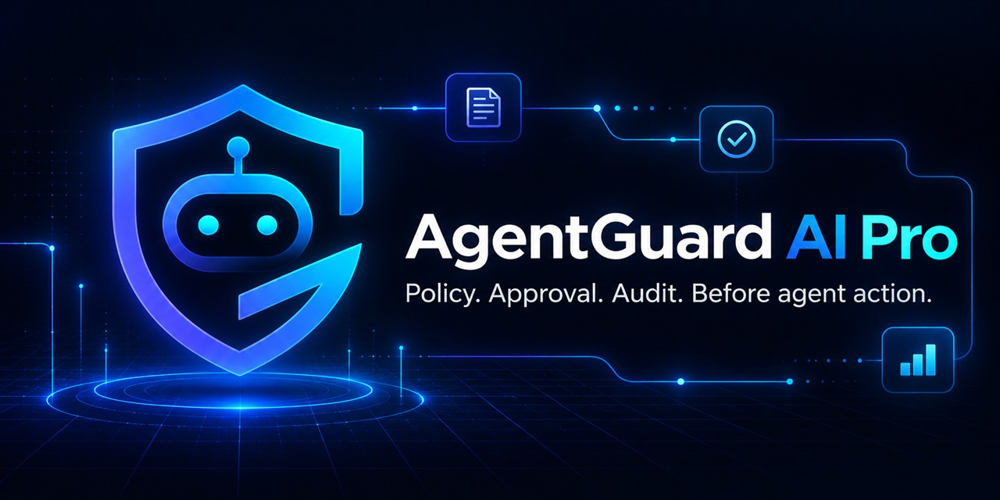
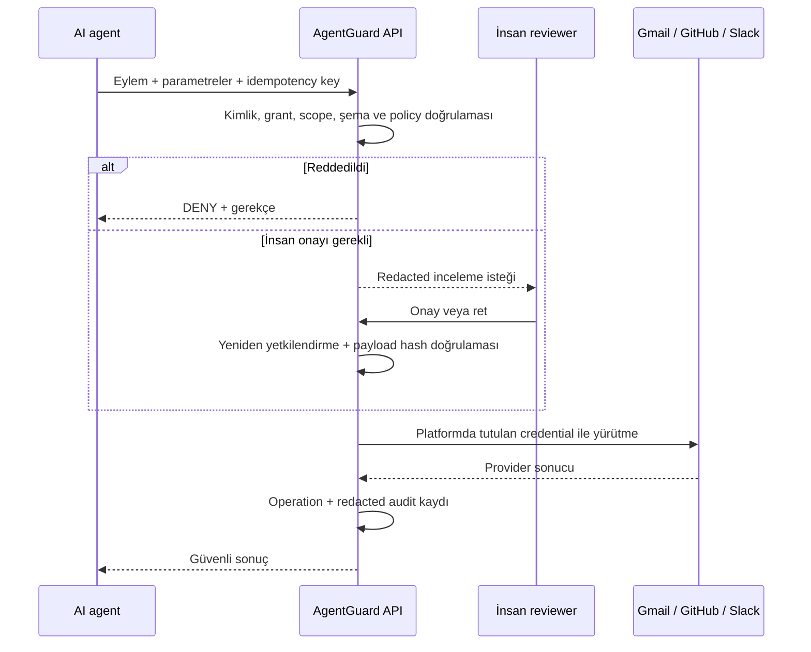
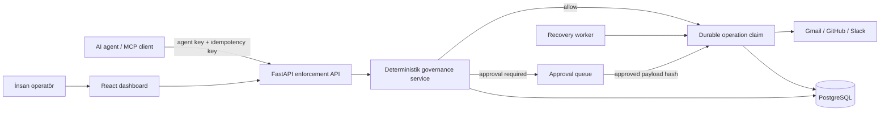

<p align="center">
  
</p>

<h1 align="center">AgentGuard AI Pro</h1>

<p align="center">
  <strong>Policy. Onay. Denetim. Agent eyleminden önce.</strong><br />
  AI agent'larının iş sistemlerinde ne yapabileceğini yöneten self-hosted kontrol katmanı.
</p>

<p align="center">
  <a href="https://github.com/furkanulusoy/agentguardai-pro/actions/workflows/tests.yml"></a>
  <a href="LICENSE"></a>
  
  
</p>

<p align="center">
  <a href="README.md">English</a> ·
  <a href="#beş-dakikada-yerel-kurulum">Hızlı kurulum</a> ·
  <a href="#mimari">Mimari</a> ·
  <a href="docs/SECURITY_REVIEW.md">Güvenlik incelemesi</a> ·
  <a href="docs/ROADMAP_TO_PRODUCTION.md">Üretim yol haritası</a>
</p>



AI agent'ları veri okuyabilir, mesaj gönderebilir ve dış sistemlerde değişiklik yapabilir. AgentGuard, agent ile bu araçlar arasına deterministik bir güvenlik sınırı koyar. Bir eylemin izinli, reddedilmiş veya insan onayına bağlı olduğuna karar verir; onaylanan connector çağrılarını yürütür ve redacted bir audit izi oluşturur.

> **Mevcut olgunluk:** kontrollü, az tenantlı self-hosted pilotlar için doğrulanmıştır. Bu sürüm internete açık, yüksek erişilebilirlikli enterprise SaaS veya compliance sertifikalı ürün olarak sunulmaz. Kalan üretim kontrolleri açıkça belgelenmiştir.

## AgentGuard neden gerekli?

Bir modele OAuth token vermek modeli yetenekli yapar; yönetişim sağlamaz. AgentGuard provider credential'larını modelden uzak tutar ve yürütmeden önce her eyleme aynı kontrolleri uygular.

| Yönetişim sınırı olmadan | AgentGuard ile |
|---|---|
| Agent geniş provider credential'ı alır | Credential platformda şifreli kalır |
| Her tool kendi permission kararını verir | Tek deterministik enforcement noktası karar verir |
| Hassas eylem hemen çalışabilir | Policy açık insan onayı isteyebilir |
| Retry dış serviste çift yan etki oluşturabilir | Kalıcı operation claim ve idempotency riski azaltır |
| Loglara prompt, token veya payload girebilir | Audit metadata redacted, hassas payload şifrelidir |
| Bir agent başka agent verisini keşfedebilir | Tenant ve agent scope erişimi uygulanır ve test edilir |

## Doğrulanmış yetenekler

- **Deterministik karar:** gerekçeli `ALLOW`, `DENY` ve `REQUIRE_APPROVAL` sonuçları.
- **En az yetki:** tenant, kullanıcı, agent, connector grant, action ve resource scope kontrolleri.
- **Onay bütünlüğü:** incelenen payload hash ile yürütmeye bağlanır ve kullanımdan önce yeniden yetkilendirilir.
- **Dayanıklı yürütme:** actor-scoped idempotency, kalıcı execution claim, güvenli `READY` recovery ve açık `UNKNOWN` sonucu.
- **Strict connector sözleşmesi:** bilinmeyen action ve alanlar provider çağrısından önce fail-closed reddedilir.
- **Credential ve session güvenliği:** şifreli connector secret'ları, HttpOnly refresh cookie, access-token rotation ve OAuth state replay koruması.
- **Audit edilebilir yönetim:** approval, policy, permission, grant ve operation olayları ham secret veya payload değerleri olmadan kaydedilir.
- **Birden fazla entegrasyon yolu:** React dashboard, Python SDK, TypeScript SDK ve MCP server aynı platform API'sini kullanır.

### Connector yüzeyi

| Connector | Desteklenen eylemler | Kaynak sınırı |
|---|---|---|
| Gmail | `list_messages`, `read_message` | Bağlı mailbox; mesaj kimliği ve seçili header alanları |
| GitHub | `list_repos`, `close_issue` | Açık `owner/repository` grant'leri |
| Slack | `list_channels`, `send_message`, `create_channel`, `delete_message`, `invite_user` | Açık kanal kimliği veya kanal adı |

GitHub OAuth, provider tarafında AgentGuard grant'inden daha geniş erişim verebilir. AgentGuard bu yetkiyi kendi uygulama sınırında daraltır. Bu ve diğer sınırlar için [güvenlik incelemesine](docs/SECURITY_REVIEW.md) bakın.

## Bir eylem AgentGuard'dan nasıl geçer?



## Beş dakikada yerel kurulum

Gereksinimler: Linux containers kullanan Docker Desktop, PowerShell 7, Git ve boş `5000` portu.

```powershell
git clone https://github.com/furkanulusoy/agentguardai-pro.git
cd agentguardai-pro
pwsh -File scripts/start-local.ps1
```

**http://localhost:5000** adresini açıp ilk workspace hesabını oluşturun. Varsayılan kullanıcı veya parola yoktur. Başlatma betiği `.env` okumaz veya değiştirmez; yerel altyapı anahtarlarını git tarafından dışlanan `.local/` dizininde üretir.

Connector kurulumu ve ilk korumalı agent akışı için [yerel ürün rehberini](docs/LOCAL_PRODUCT.md) izleyin.

## Yerel AI agent ile test

Projede bulunan runner, Ollama üzerinden yerel Qwen3 modeli kullanabilir. Model tool çağrısı önerir; yetkilendirme, onay, yürütme ve audit sorumluluğu AgentGuard'da kalır.

```powershell
ollama pull qwen3:8b
$env:AGENTGUARD_AGENT_KEY = "BURAYA_AGENTGUARD_AGENT_ANAHTARINI_YAPISTIRIN"
python sdk/python/examples/nemotron_agent.py --provider ollama "GitHub repolarımı listele. Hiçbir şeyi değiştirme."
```

Değişiklik yapan testlerde yalnız test repository'si kullanın. Hosted NVIDIA ve yerel Ollama akışının tamamı [guarded model demo](docs/NEMOTRON_DEMO.md) belgesindedir.

## Mimari



`apps/api/services/governance.py` platformdaki tek enforcement noktasıdır. SDK'lar, dashboard, connector'lar ve MCP server authorization policy'yi yeniden yazmaz.

| Dizin | Sorumluluk |
|---|---|
| `apps/api` | HTTP API, authentication, tenant yönetimi ve enforcement |
| `apps/worker` | Güvenle tekrar alınabilen `READY` operasyonların recovery süreci |
| `apps/web` | React yönetim paneli |
| `connectors` | Strict action şemalarıyla Gmail, GitHub ve Slack adapter'ları |
| `infrastructure` | PostgreSQL modelleri, JWT ve şifreli secret saklama |
| `agentguard` | Framework bağımsız Python guardrail engine |
| `sdk/python`, `sdk/typescript` | Platform API'si için ince istemciler |
| `apps/mcp_server` | MCP ile platform arasındaki adapter |
| `tests` | Core, API, UI, SDK ve PostgreSQL güvenlik regresyonları |

## Doğrulama

Mevcut pilot sürüm, gerçek PostgreSQL üzerinde **322 Python testini sıfır skip ile**, **11 frontend testini** ve **10 TypeScript SDK testini** geçti. CI ayrıca Ruff, mypy, production build, dependency audit, secret scan, MCP startup ve Docker self-host smoke testlerini çalıştırır.

```powershell
pwsh -File scripts/test-local.ps1
npm --prefix apps/web ci
npm --prefix apps/web run lint
npm --prefix apps/web test
npm --prefix apps/web run build
npm --prefix sdk/typescript ci
npm --prefix sdk/typescript test
npm --prefix sdk/typescript run build
```

Kesin ortam ve sınırlar için tarihli [release doğrulama notlarına](docs/RELEASE_NOTES.md) bakın. Güvenlik açıklarını public issue ile paylaşmayın; [SECURITY.md](SECURITY.md) sürecini kullanın.

## Güvenlik sınırı ve yol haritası

AgentGuard yalnız kendi API'sinden geçen eylemleri yönetebilir. Agent'a doğrudan provider credential vermeyin; bu, platformu baypas eder. Kalıcı execution claim çift yan etki riskini azaltır ancak provider desteği olmadan evrensel exactly-once garantisi verilemez; belirsiz sonuçlar operatör doğrulaması için `UNKNOWN` durumunda durur.

OIDC/SAML SSO, SCIM, KMS/Vault tabanlı key management, WORM audit export, retention automation, broker destekli outbox, dağıtık rate limiting, merkezi observability, provider reconciliation ve yüksek erişilebilirlik deployment yol haritasındadır. Öncelikler ve kabul koşulları [güvenlik incelemesi](docs/SECURITY_REVIEW.md) ile [üretim yol haritasında](docs/ROADMAP_TO_PRODUCTION.md) kayıtlıdır.

## Katkı ve lisans

Bir güvenlik sınırını değiştirmeden önce [CONTRIBUTING.md](CONTRIBUTING.md) belgesini okuyun. Sürüm geçmişi [CHANGELOG.md](CHANGELOG.md) dosyasındadır.

AgentGuard AI Pro, [AGPL-3.0-or-later](LICENSE) ile lisanslanır.
